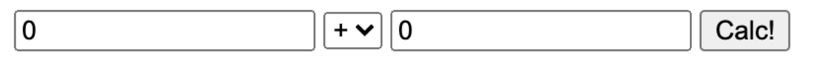

# Typescript

1. Добавить следующие элементы на html страницу:
   - 2 поля для ввода числовых значений 
   - select поле для выбора типа операции: +, -, /, *; 
   - кнопку отправки
1. По нажатию на кнопку отправки в консоль должен вывестись результат в зависимости от выбранного
типа операции и значений в 2 полях ввода
1. - Нужно использовать typescript.
   - Должна быть отдельная функция для расчёта и вывода результата. 
   - Значения типа операций должны храниться в Enum и совпадать со значениями select поля в html.